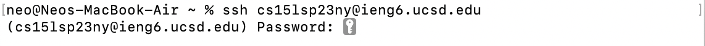
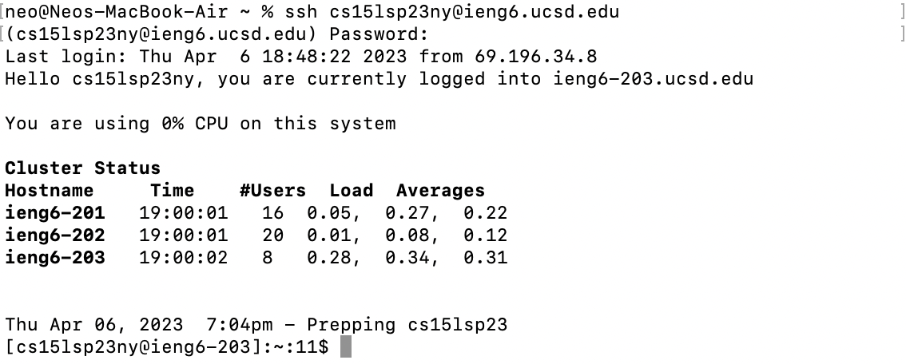

# First Lab Report

### Installing VScode
---
I have already installed VScode before, and I forgot how to do that already. But here is the link to a [YouTube](https://www.youtube.com/watch?v=rXus3c3U10w) tutorial.

After installing, you can pull up your terminal and type `$ code`, which will directly open up VScode. VScode looks something like this 
> ![vscode][3]

### Remotely Connecting
---
1. Search up your CSE15L account [here](https://sdacs.ucsd.edu/~icc/index.php).
2. Set up your password for the account and wait for ~10 minutes.
3. Go to your terminal and try connecting to the remote server with the termina command `$ ssh cs15lsp23zz@ieng6.ucsd.edu` [replace `cs15lsp23zz` with your username].
4. Enter your password when prompted, like the following picture 
> 
5. Done, and you will see something like this!
> 

### Trying Some Command
---
Just try whatever commands you want! Here are some commands that I tried: `$ ls -a`, `pwd`, `cd ~`, `ls -lat`
> ![commands][4]
CONFLICT

[3]: images/vscode.png
[4]: images/commands.png
