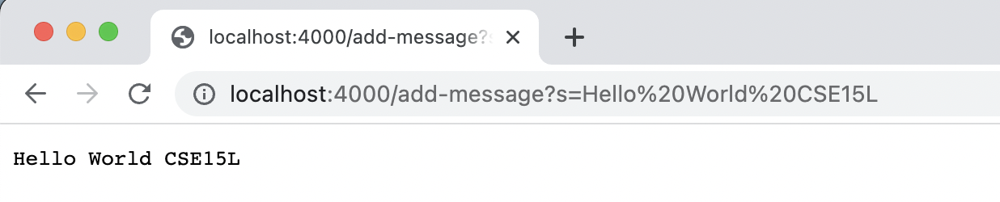
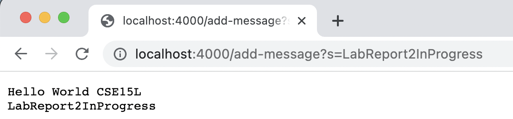
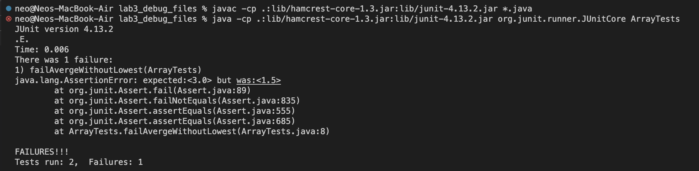

# Part 1

### The block below is the code for StringServer.java:

```
import java.io.IOException;
import java.net.URI;

class Handler implements URLHandler {
    // The one bit of state on the server: a number that will be manipulated by
    // various requests.
    String strs = "";

    public String handleRequest(URI url) {

        if (url.getPath().contains("/add-message")) {
            String[] parameters = url.getQuery().split("=");

            if (parameters[0].equals("s")) {

                if (strs.equals("")) {
                    strs = strs + parameters[1];
                    return strs;
                }

                strs = strs + "\n" + parameters[1];
                return strs;
            }
        }

        return "Invalid request";
    }
}

class StringServer {
    public static void main(String[] args) throws IOException {
        if(args.length == 0){
            System.out.println("Missing port number! Try any number between 1024 to 49151");
            return;
        }

        int port = Integer.parseInt(args[0]);

        Server.start(port, new Handler());
    }
}
```

### Below are two demonstrations of using `/add-message`:
<p align="center" width="100%">
    
</p>


+ **Which methods in your code are called?** *handleRequest()*
  1. When an URL is accessed, the method `handleRequest()` in class `Handler` will be called, and the argument `url` passed into the method will be the entire URL.
  2. Then, the method will parse the URL by first checking whether its URL path contains the string `"/add-message"`. The URL path in this case would be everything after `localhost:4000`. It does this by invoking `url.getPath()` followed by a simple `contains()` check.
  3. If the URL does contain `"/add-message"`, it would proceed to get the query by invoking `url.getQuery()`, which would return everything after the `?` in the URL. In this case, the query would be `s=Hello World CSE15L`. If the URL does NOT contain `"/add-message"`, it would simply show the message `"Invalid Request"` on the browser.
  4. Then, it would split the query according to `=`. In this case, the query was split into an array with two elements: first element being the string `"s"` and second element being the string `"Hello World CSE15L"`. [Note: `%20` shown in URL simply means space]
  5. If after splitting and the first element equal `"s"`, the class field `strs` will be updated to append the second element. Hence, here, `strs` was updated from empty string `""` to `"Hello World CSE15L"`. Otherwise, return `"Invalid Request"` to browser.
  6. Eventually it just print out the final value of the class field `strs` to the browser.

+ **What are the relevant arguments to those methods, and the values of any relevant fields of the class?**
  + The entire URL is the argument `url` passed into `handleRequest()`. Then, the path of URL was returned by invoking `url.getPath()`. The path was then called against `contains()` to see if it contains the string `"\add-message"`. After that, the query was returned by invoking `url.getQuery()`. Then, the query was called against `split("=")`. Eventually, anything after the equal sign will be concatenated with the original value of the field `strs`.
+ **How do the values of any relevant fields of the class change from this specific request? If no values got changed, explain why.**
  + There is only one field `strs` in the class, and it was updated from an empty string `""` to `"Hello World CSE15L"`.

<p align="center" width="100%">
    
</p>

+ **Which methods in your code are called?** *handleRequest()*
  1. When an URL is accessed, the method `handleRequest()` in class `Handler` will be called, and the argument `url` passed into the method will be the entire URL.
  2. Then, the method will parse the URL by first checking whether its URL path contains the string `"/add-message"`. The URL path in this case would be everything after `localhost:4000`. It does this by invoking `url.getPath()` followed by a simple `contains()` check.
  3. If the URL does contain `"/add-message"`, it would proceed to get the query by invoking `url.getQuery()`, which would return everything after the `?` in the URL. In this case, the query would be `s=LabReport2InProgress`. If the URL does NOT contain `"/add-message"`, it would simply show the message `"Invalid Request"` on the browser.
  4. Then, it would split the query according to `=`. In this case, the query was split into an array with two elements: first element being the string `"s"` and second element being the string `"LabReport2InProgress"`.
  5. If after splitting and the first element equal `"s"`, the class field `strs` will be updated to append the second element. Hence, here, `strs` was updated from empty string `""` to `"LabReport2InProgress"`. Otherwise, return `"Invalid Request"` to browser.
  6. Eventually it just print out the final value of the class field `strs` to the browser.

+ **What are the relevant arguments to those methods, and the values of any relevant fields of the class?**
  + The entire URL is the argument `url` passed into `handleRequest()`. Then, the path of URL was returned by invoking `url.getPath()`. The path was then called against `contains()` to see if it contains the string `"\add-message"`. After that, the query was returned by invoking `url.getQuery()`. Then, the query was called against `split("=")`. Eventually, anything after the equal sign will be concatenated with the original value of the field `strs`.
+ **How do the values of any relevant fields of the class change from this specific request? If no values got changed, explain why.**
  + There is only one field `strs` in the class, and it was updated from `"Hellow World CSE15L"` to `"Hello World CSE15L\nLabReport2InProgress"`.

# Part 2
## A failure-inducing input for the buggy program

***The JUnit test:***
```
import static org.junit.Assert.*;
import org.junit.*;

public class ArrayTests {
  @Test
  public void failAvergeWithoutLowest() {
    double[] input1 = {1.0, 2.0, 4.0, 1.0, 1.0};
    assertEquals(3.0, ArrayExamples.averageWithoutLowest(input1), 0.0001);
  }
}
```
***The associated codes:***
```
public class ArrayExamples {

  static double averageWithoutLowest(double[] arr) {
    if(arr.length < 2) { return 0.0; }
    
    double lowest = arr[0];
    for(double num: arr) {
      if(num < lowest) { lowest = num; }
    }
    
    double sum = 0;
    for(double num: arr) {
      if(num != lowest) { sum += num; }
    }
    
    return sum / (arr.length - 1);
  }
}
```

## An input that doesn’t induce a failure

***The JUnit test:***
```
import static org.junit.Assert.*;
import org.junit.*;

public class ArrayTests {
  @Test
  public void passAverageWithoutLowest() {
    double[] input1 = {1.0, 2.0, 4.0};
    assertEquals(3.0, ArrayExamples.averageWithoutLowest(input1), 0.0001);
  }
}

```
***The associated codes:***
```
public class ArrayExamples {

  static double averageWithoutLowest(double[] arr) {
    if(arr.length < 2) { return 0.0; }
    
    double lowest = arr[0];
    for(double num: arr) {
      if(num < lowest) { lowest = num; }
    }
    
    double sum = 0;
    for(double num: arr) {
      if(num != lowest) { sum += num; }
    }
    
    return sum / (arr.length - 1);
  }
}
```

## The symptom
<p align="center" width="100%">
    
</p>

## The bug, read *LINE 8*

***Before:***
```
  static double averageWithoutLowest(double[] arr) {
    if(arr.length < 2) { return 0.0; }
    
    double lowest = arr[0];
    for(double num: arr) {
      if(num < lowest) { lowest = num; }
    }
    
    double sum = 0;
    for(double num: arr) {
      if(num != lowest) { sum += num; }
    }
    
    return sum / (arr.length - 1);
  }
```
***After:***
```
  static double averageWithoutLowest(double[] arr) {
    if(arr.length < 2) { return 0.0; }
    
    double lowest = arr[0];
    for(double num: arr) {
      if(num < lowest) { lowest = num; }
    }
    
    double sum = 0;
    int count = 0;
    for(double num: arr) {
      if(num != lowest) { 
        count += 1;
        sum += num; 
        }
    }
    
    return sum / count;
  }
```
- The method `averageWithouLowest()` intends to find the average value of an array after dropping all elements with the lowest value in the array. However, the bug is that when there are multiple lowest-valued elements, they will all be dropped, yet averaging out by `n-1` elements.
- My failure inducing input contains multiple lowest-valued elements. The symptom showed that the actual return value was much lower than the expected return value. So naturally I thought it might either be dropping too many elements or was "over-averaged" out. Then I followed along the logic of the code, I figured the implementation of dropping lowest-valued elements seems reasonable, so I turned to thinking whether it was "over-averaged". Unsurprisingly, it was, so I just changed the corresponding code.

# Part 3
Before lab 2, I did not know how a URL request work. But after working through lab 2 and actually coding a simple local server, I understand that the server reads request by simply parsing the path and the query. I believe there is much more than that, but it shows that the way the server handle requests can be done in a very basic way by just splitting up the strings followed by some if-else statements.


