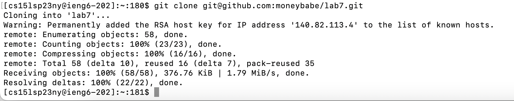
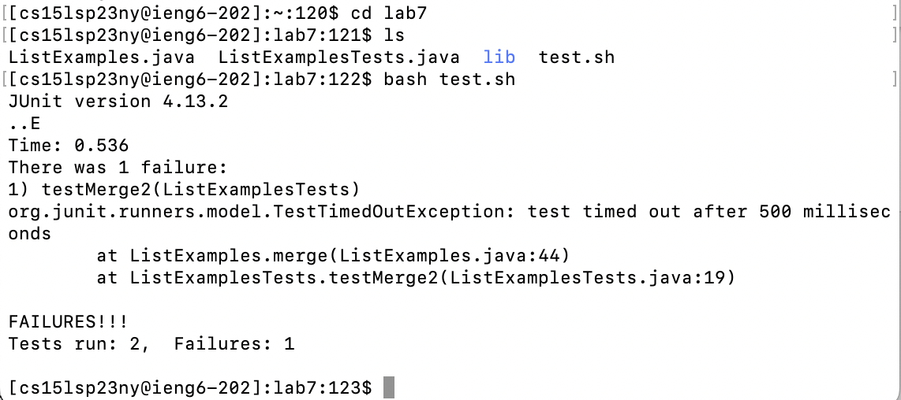
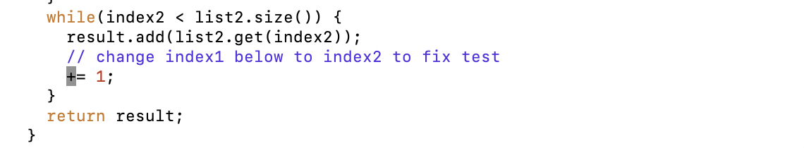
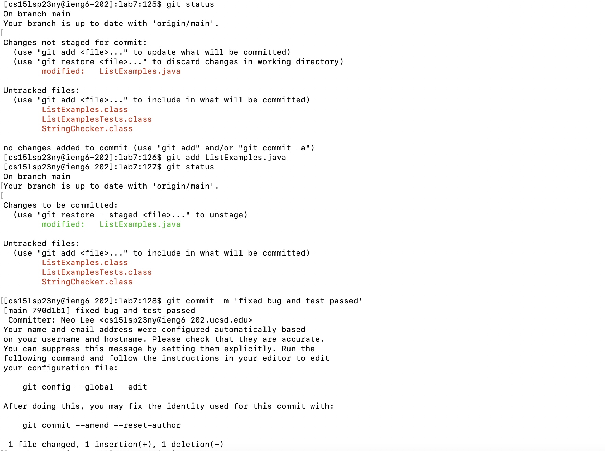

*Note: the command index might not be in chronologically order because I did not finish the lab report in one go. However, the command sequence itself is correct. Simply disregard the command index when reading.*
## Step 4: Log into ieng6

> Key pressed: 
`$ ssh cse15l`
- I have generated the ssh private and public key pair on my local computer for ieng6 server by following the lab instruction. Besides, I edited the `~/.ssh/config` file on my local computer to set the hostname alias to be `cse15l`. So now I don't have to type the long hostname `cs15lahsdjksahd@ieng6.ucsd.edu`, and I don't need to type the password anymore.

## Step 5: Clone your fork of the repository from your Github account

> Key pressed: 
`$ git clone git@github.com:moneybabe/lab7.git`
- Here because I have set up the ssh private and public key pair for my github account on my ieng6 account during the lab session, I can use `git clone` using ssh key.

## Step 6: Run the tests, demonstrating that they fail

> Key pressed: 
`$ cd lab7`
`$ ls`
`$ bash test.sh`
- We `cd` into `~/lab7/` and run `test.sh`. Because I have read the file content of `test.sh` beforehand, I know the bash script is simply two lines of `javac` and `java` running with JUnit. Therefore, I just ran the file with bash, which ran the tests and output failures.

## Step 7: Edit the code file ListExamples.java to fix the failing test
### Step 7-1

> Key pressed: 
`$ vim ListExamples.java`
- I opened the `ListExamples.java` file with `vim`

### Step 7-2

> Key pressed: 
`/index1` `<Enter>`
- I search for the pattern `index1` by typing `/index1` in `vim` normal mode and press `Enter`. Then I press `n` to go to the next match. I found the line `return list.index1;` and I know this is the line that causes the test to fail.

### Step 7-3

> Key pressed:
`n` x 8
- I press `n` 8 times to go to the next match. I found the line `index1 += 1;` and I know this is the line that causes the test to fail.

### Step 7-4

> Key pressed:
`d` `<shift> + <right arrow>`
- I press `d` to enter delete mode and press `<shift> + <right arrow>` to select the word `index1` and delete it. `<shift> + <right arrow>` is an alternative shortcut to `w` for going to the next word. I used `<shift> + <right arrow>` here simply because I was more familiar with it.

### Step 7-5

> Key pressed:
`i`
- I press `i` to enter insert mode.

### Step 7-6

> Key pressed:
`index2 <space>` 
- I type `index2` and press `<space>` to insert a space after `index2`.

### Step 7-7

> Key pressed:
`<esc>` `:wq` `<enter>`
- I press `<esc>` to exit insert mode and type `:wq` to save and quit `vim`.

## Step 8: Run the tests, demonstrating that they now succeed

> Key pressed: 
`$ bash test.sh`
- I run `test.sh` again and this time the tests succeed.

## Step 9: Commit and push the resulting change to your Github account
### Step 9-1

> Key pressed: 
`$ git status`
`$ git add ListExamples.java`
`$ git status`
`$ git commit -m 'fixed bug and test passed'`
- I first check the status of the git repository by running `$ git status`. Then I add the file `ListExamples.java` to the staging area by running `$ git add ListExamples.java`. Then I check the status again. Then I commit the change with the commit message `'fixed bug and test passed'`. Then I push the change to my github repository.

### Step 9-2

> Key pressed: 
`$ git push`
- I push the change to my github repository.

## Step 10: Check the changes on Github

- We can see the commit message `'fixed bug and test passed'` on github. It showed 3 hours ago simply because I committed the changes on my local computer during the lab session and pushed the changes to github after the lab session (around 3 hours later).