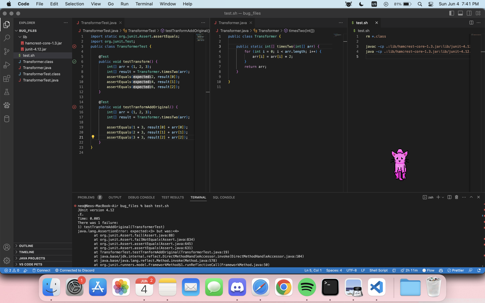
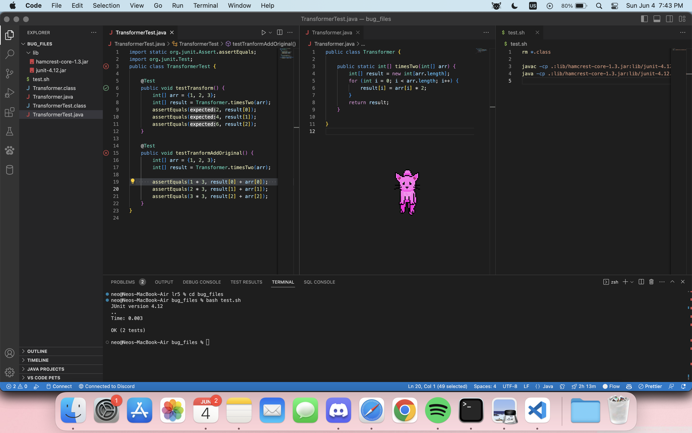

## Part 1 – Debugging Scenario
### Student A (6:00pm 06/04/2023)
**What environment are you using (computer, operating system, web browser, terminal/editor, and so on)?**
*I am using MacOS with zsh. I use VSCode for my text editor.*

**Detail the symptom you're seeing. Be specific; include both what you're seeing and what you expected to see instead. Screenshots are great, copy-pasted terminal output is also great. Avoid saying “it doesn't work”.**
*I am writing a static method `timesTwo` in the class `Transformer`. The method would take an int array and multiply every element by two then return the new array. However, when I run my unit test, it is not outputting what I expected.*

**Detail the failure-inducing input and context. That might mean any or all of the command you're running, a test case, command-line arguments, working directory, even the last few commands you ran. Do your best to provide as much context as you can.**
*I attached a screenshot of the failed test and all my files. The tests are in `TransformerTest.java` and the implementation is in `Transformer.java`.*

*When I run `bash test.sh`, which basically just compiles with JUnit and runs the test, I get the following output:*
```
neo@Neos-MacBook-Air bug_files % bash test.sh
JUnit version 4.12
.E.
Time: 0.004
There was 1 failure:
1) testTranformAddOriginal(TransformerTest)
java.lang.AssertionError: expected:<3> but was:<4>
        at org.junit.Assert.fail(Assert.java:88)
        at org.junit.Assert.failNotEquals(Assert.java:834)
        at org.junit.Assert.assertEquals(Assert.java:645)
        at org.junit.Assert.assertEquals(Assert.java:631)
        at TransformerTest.testTranformAddOriginal(TransformerTest.java:19)
        ... some JUnit stuff ...

FAILURES!!!
Tests run: 2,  Failures: 1
```

*This states that I failed the test `testTranformAddOriginal`.
The test is as follows:*
```
@Test
    public void testTranformAddOriginal() {
        int[] arr = {1, 2, 3};
        int[] result = Transformer.timesTwo(arr);
        
        assertEquals(1 * 3, result[0] + arr[0]);
        assertEquals(2 * 3, result[1] + arr[1]);
        assertEquals(3 * 3, result[2] + arr[2]);
    }
```
*, which is basically adding the original array `{1, 2, 3}` with the transformed array `{2, 4, 6}` element-wise, so I am expecteding `{3, 6, 9}`. But the the failed test says the first element of the final array is `4` instead of `3`.*


### TA (7:00pm 06/04/2023)
*It seems like your `timesTwo` method is altering the input array in-place, which means it completely changes the content of the input array, instead of returning a new array with the transformed elements.*

*Therefore, in your `testTransformAddOriginal` test, after running line 17:*
```
int[] result = Transformer.timesTwo(arr);
```
*, `result` and `arr` contain the same content `{2, 4, 6}`, and now when you add `result` and `arr` together element-wise, you would get `{4, 8, 12}` instead of `{3, 6, 9}`. So now it just depends on whether you want your implementation to change the input array in-place or not.*

### Student A (7:30pm 06/04/2024)
*I see. Thank you so much! I have changed my implementation to return a new array instead of doing in-place transform now. It is working completely fine now! (Sorry for replying a year late :p)*


## Part 2 – Reflection
The terminal command line shortcuts are definitely very helpful. Like the `<option> + <left/right key>` to navigate between words and `<control> + w` to delete a word. It definitely helps me navigate through directories faster and less typo (which ALWAYS infuriates me). 

Also vim was pretty cool, it allows me to make minor script to perform small task very quickly, or sometimes I just use it to alter a few lines of code in a file without opening the whole file in VSCode. It definitely streamlined my workflow!